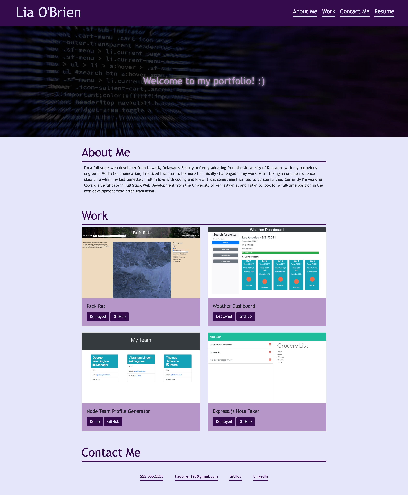

# portfolio

This is my official developer portfolio, which holds my professional background, recent projects, and contact information.

My portfolio can be viewed here: [https://liaobrien.github.io/portfolio/](https://liaobrien.github.io/portfolio).

## Table of Contents

- [Installation](#installation)
- [Usage](#usage)
- [Credits](#credits)
- [License](#license)

## Installation

N/A

## Usage

This page can be accessed and used on any standard web browser.

## Credits

CSS framework Bootstrap is being utilized.

## License

This project is licensed under the MIT license.

